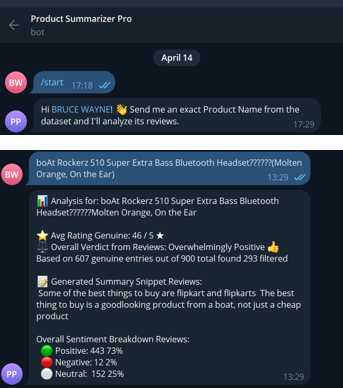

# 🛍️ Product Review Analysis & Fake Review Detection

This project performs **Natural Language Processing (NLP)** on product reviews from platforms like **Flipkart** and **Instagram**, identifies the overall sentiment (Positive, Negative, Neutral), and flags **fake/spam reviews** — including **negative fake reviews** that could mislead customers.

## 📌 Features

- ✅ **Sentiment Analysis** using TextBlob
- 🧠 **Fake Review Detection** using rule-based heuristics
- 👎 Detection of **Negative Fake Reviews** (competitor attacks / bots)
- 🔍 Promo Keyword Bias Detection (e.g., "1+1", "discount", "limited offer")
- 📊 Comprehensive Summary Generation per Product
- 📷 Instagram review support via manual text input
- 🔄 Merge insights from Flipkart dataset + external reviews (like Instagram)

## 📂 Dataset Used

- **Flipkart Product Reviews Dataset** from Kaggle  
  *(Includes product name, review text, sentiment, and rating)*  
  [Kaggle Link](https://www.kaggle.com/datasets)

## 🛠️ How It Works

### 1. Load and Preprocess Reviews
- Clean review text
- Apply TextBlob for sentiment classification

### 2. Detect Fake/Spam Reviews
- Rule-based detection:
  - Very short/long reviews
  - Repetitive words
  - Spammy phrases like "buy now", "worst", "scam"
  - Too many exclamation marks or all-caps

### 3. Identify Negative Fake Reviews
- `is_negative_fake = Sentiment == 'Negative' and is_fake == True`

### 4. Optional: Analyze Instagram Review
- Manually input Instagram product review
- Compare its sentiment + promotional tone with Flipkart reviews

### 5. Generate Final Verdict
- % of positive, neutral, and negative reviews
- % of promo-biased reviews
- % of fake & negative fake reviews
- Suggested recommendation

## 📈 Example Output
### 🧠 TELEGRAM BOT

